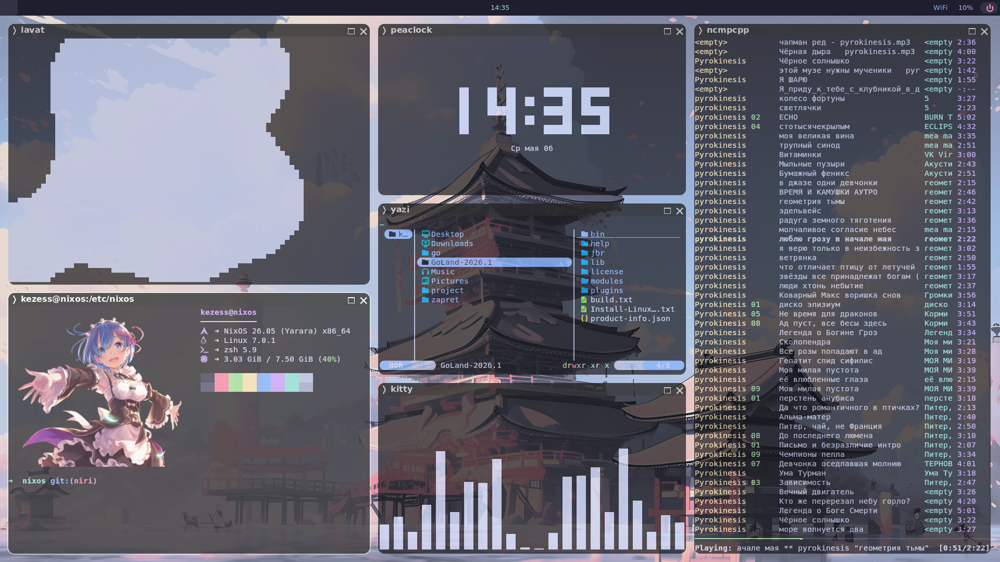
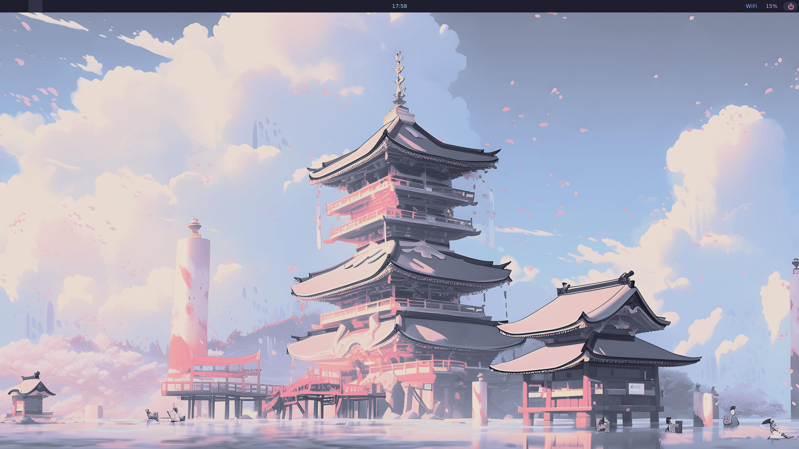
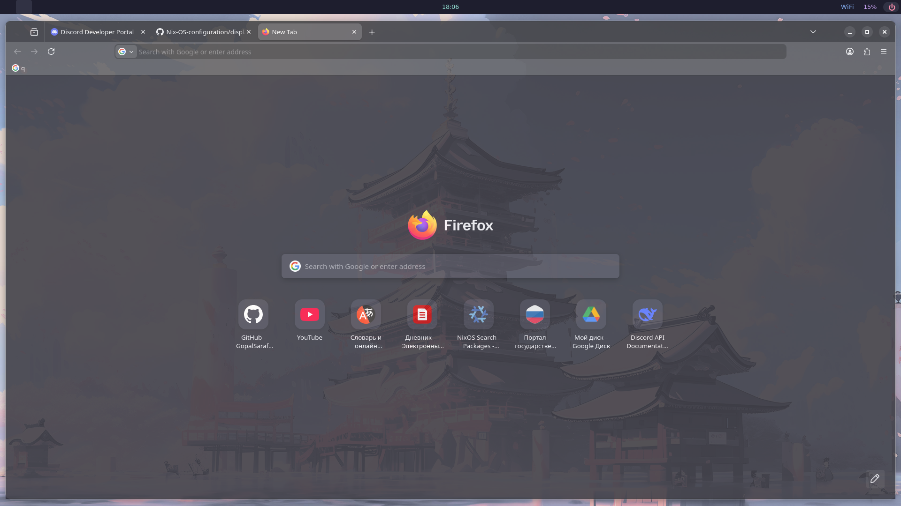
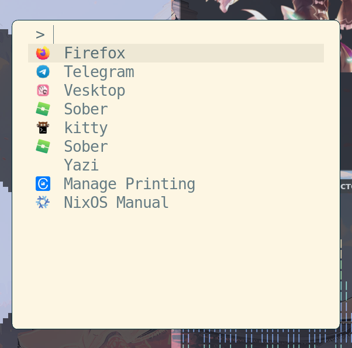

# Nix-OS Configuration (Niri Branch) 🌀

Personal **NixOS** configuration tailored for the **Niri** compositor with a focus on transparency, blur, and aesthetic minimalism.

---
# Example




## 📂 File Structure


| Module | File Path | Description |
| :--- | :--- | :--- |
| **System** | `/etc/nixos/configuration.nix` | Core system settings and imports |
| **Niri** | `/etc/nixos/display/niri.nix` | WM configuration and custom keybindings |
| **Waybar** | `/etc/nixos/display/waybar.nix` | Status bar with CSS styling |
| **Mako** | `/etc/nixos/display/mako.nix` | Notification daemon (12px radius, translucent) |
| **Fuzzel** | `/etc/nixos/display/fuzzel.nix` | Wayland-native application launcher |
| **User** | `/etc/nixos/default/user.nix` | User profile and shell environment  and fonts |
| **Packages** | `/etc/nixos/default/packages.nix` | System-wide apps|

---
 
# ⌨️ Full Hotkeys & Aliases

## Core & Apps


| Shortcut | Action |
| :--- | :--- |
| `Mod + T` | Open **Kitty** Terminal |
| `Mod + D` | Open **Fuzzel** Launcher |
| `Mod + W` | Open **Firefox** |
| `Mod + F` | Open **Dolphin** File Manager |
| `Mod + G` | Launch **GoLand** IDE |
| `Mod + Z` | Start **Zapret** Service (in Kitty) |
| `Mod + M` | Open **NCMPCPP** Music Player |
| `Mod + L` | Launch **Lavat** (Lava Lamp) |
| `Mod + Q` | Close Active Window |
| `Mod + Shift + E` | Exit Niri | 
### Mod + G and Mod +Z require pre-installation of these packages via a browser. I use patched GOland.


## Screenshots & Media


| Shortcut | Action |
| :--- | :--- |
| `Print` | Capture Full Screen to Clipboard |
| `Mod + Shift + S` | Capture Area to Clipboard (Slurp) |
| `fn + F2 / F3` | Volume Down / Up |
| `fn + F5 / F6` | Brightness Down / Up |

## Navigation & Layout


| Shortcut | Action |
| :--- | :--- |
| `Mod + Left / Right` | Focus Column Left / Right |
| `Mod + Up / Down` | Focus Window Up / Down |
| `Mod + Shift + H / L` | Move Column Left / Right |
| `Mod + C` | Center Column |
| `Mod + Minus / Equal` | Decrease / Increase Column Width |
| `Mod + 1-3` | Switch Workspace 1-3 |
| `Mod + Shift + 1-3` | Move Column to Workspace 1-3 |

## Shell Aliases


| Alias | Command | Action |
| :--- | :--- | :--- |
| `nix-up` | `sudo nixos-rebuild switch` | Rebuild and apply system configuration |
| `nix-l` | `nixos-rebuild list-generations` | List system generations |
| `nix-cl` | `sudo nix-collect-garbage -d` | Clean up old generations |
| `c` | `clear && neofetch` | Clear terminal and show system info |

---

# ⚠️ Important Note

When installing on a new machine, **do not replace** your `hardware-configuration.nix`. Your file contains unique disk UUIDs required for the system to boot properly.

```bash
# Deployment:
git clone -b niri https://github.com
sudo cp -r Nix-OS-configuration/* /etc/nixos/
nix-up
```

